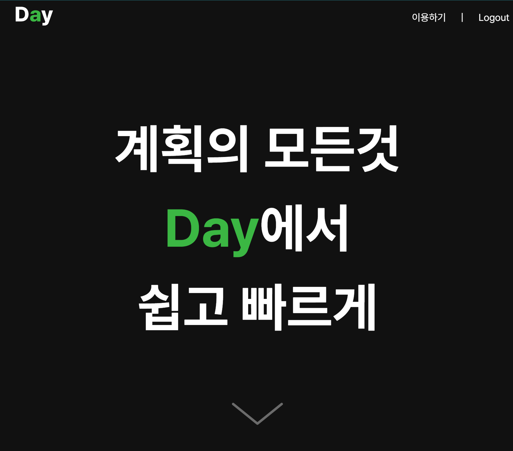

<div align=center>

<h1>Day</h1>

<h3>다양한 콘텐츠를 할일로 등록하고 진행상황을 한눈에
 확인하세요!
</h3>

<br/>



**[Day 바로가기](https://daaay.vercel.app)**

</div>
<br/>

## 🖼️ 프로젝트 소개

#### 유저가 다양한 콘텐츠(아티클, 강의 영상, 줌 미팅 일정, 강의 PDF 등)를 할일 목록으로 관리하고, 학습 진도나 프로젝트 진행 상황을 대시보드로 보여주며 각 할일에 대한 노트를 작성해 관리하는 서비스입니다.

<br>

## 👥 팀원 소개

|                                                                                        팀장 FE\_고성선                                                                                         |                                                                            팀원 FE\_최무현                                                                            |  팀원 DE\_이은송  |
| :--------------------------------------------------------------------------------------------------------------------------------------------------------------------------------------------: | :-------------------------------------------------------------------------------------------------------------------------------------------------------------------: | :---------------: |
|                                                                                         **담당 부분**                                                                                          |
| - 프로젝트 초기 세팅 <br> - 할일 생성/수정 모달 <br> - 회원가입/로그인 페이지 <br> - 할일 목록 페이지 <br> - 노트 쓰기/수정 페이지 <br> - 노트 링크 임베디드 <br> - Spinner <br> - progressbar | - Axios 설정 <br> - Next Auth 인증 토큰 관리 <br> - GNB <br> - 랜딩 페이지<br> - 대시보드 페이지 <br> - 목표 상세 페이지 <br> - 노트 모아보기 페이지 <br> - jest 설정 | - 전체적인 디자인 |

<br/>

## 🛠️ 기술 스택 및 협업

### 개발


### 테스트


### 프로젝트 일정


> Github Project와 Issue를 연결하여 주차별로 일정을 관리하였습니다.

### 협업 툴


> webhook을 통해 discord와 연결하여 PR, issue 등 프로젝트 변동 사항에 대해 빠르게 피드백 할 수 있었습니다.

<br/>

## 📝 프로젝트 컨벤션

#### 상수 : CAPITAL_SNAKE_CASE

#### 변수 / 함수 : camelCase

#### 컴포넌트 / 인터페이스 : PascalCase

#### 콜백 제외한 컴포넌트 및 함수는 선언형으로 통일

#### 간단한 함수는 화살표함수로 작성

#### export default 는 컴포넌트 에 적용 일반 함수 등은 export 사용

### 예시 )

```jsx
`상수`

const MY_NAME = 'thomas';

`변수, 함수`

const roomNumber = 3;

function getYourData() {
	console.log("hello world");
}

`클래스, 컴포넌트, 인터페이스 예시`

class Person{}

export default function Person () {}

interface Person {}

`함수 예시`
function calculate () {}
function Home () {}

`화살표 함수 예시`
<button onClick=(()=> setState(!state))>상태 변경</button>
```

### 디렉터리 구조

#### 도메인별로 대괄호(’()’)로 묶어서 생성

#### 일회성 타입은 그 컴포넌트 상단에 작성

#### 여러차례 사용되는 타입은 types에 작성 ex) fetch data

### 예시 )

```jsx
├── utils // 공통 함수
│   └── calculateTime.ts
├── types // 공통 타입
│   └── User.ts
│   └── TodoItem.ts
├── constants // 공통 상수
|   └── buttonNameList.ts
├── components // 공용 컴포넌트
│   └── Button  // Button 컴포넌트 관련 요소들
│       └── Button.tsx // 컴포넌트
├── api
│   └── axios.ts // axios 설정
│   └── mypage // 도메인별 api 설정
│       └── updateUserProfile.ts // 요청별 api 파일
├── stores // zustand 전역상태 폴더
│   └── useUserStore.ts
├── app
│   └── (home) // home 도메인
│       └── layout.tsx // 공통 레이아웃
│       └── page.tsx   // '/'
│   └── (mypage) // mypage 도메인
│       └── mypage //
│           └── _components // mypage 컴포넌트
│           └── _utils // mypage 함수
│           └── _types // mypage 타입
│           └── _constants // mypage 상수
│           └── layout.tsx // mypage 레이아웃
│           └── page.tsx // '/mypage'
├── tailwind.config.ts // 애니메이션 및 여러군데 공통으로 사용되는 스타일 정의
├── assets
│   └── images
│   └── svgs
└── styles
    └── global.css
```

### 커밋 메시지

| Type 키워드 | 사용 시점                                                             |
| ----------- | --------------------------------------------------------------------- |
| feat        | 새로운 기능 추가                                                      |
| fix         | 버그 수정                                                             |
| docs        | 문서 수정                                                             |
| style       | 코드 스타일 변경 (코드 포매팅, 세미콜론 누락 등)기능 수정이 없는 경우 |
| design      | 사용자 UI 디자인 변경 (CSS 등)                                        |
| test        | 테스트 코드, 리팩토링 테스트 코드 추가                                |
| refactor    | 코드 리팩토링                                                         |
| build       | 빌드 파일 수정                                                        |
| ci          | CI 설정 파일 수정                                                     |
| perf        | 성능 개선                                                             |
| chore       | 빌드 업무 수정, 패키지 매니저 수정 (gitignore 수정 등)                |
| rename      | 파일 혹은 폴더명을 수정만 한 경우                                     |
| remove      | 파일을 삭제만 한 경우                                                 |

#### PR 리뷰 남기고 본인이 리뷰 확인하여 적용 한 뒤 merge

  <br/>

## 트러블 슈팅

### axios interceptor 중복된 네트워크 요청

<b>Situation</b>: Axios interceptor를 사용해 api 콜이 있을 때 마다 nextAuth의 getSession함수를 호출하고, 응답을 request header에 담아 보내도록 로직을 작성  
<b>Problem</b>: api 요청이 있을 때마다 같은 내용이 담겨있는 getSession 요청을 매번 불필요하게 하는 문제 발견  
<b>Action</b>: getSession에 대한 응답을 localStorage에 저장하고 localStorage에 담긴 token의 유효성을 검사하여 통과하지 못할 때만 getSession요청 다시 보내도록 로직을 수정

### React-quill document 접근 에러

<b>Situation</b>: content Editor를 react-quill로 정하고 적용을 다 하고 나서 'use client'를 명시해 두었는데도 서버측에서 document에 접근 할 수 없다는 에러가 발생<br />
<b>Problem</b>: 'use client'는 완전한 서버측 접근을 막을 순 없다는 것이 문제였고 Next.js 13 이상의 App Router에서는 클라이언트 측에서만 사용되어야 하는 라이브러리를 동적으로 import 해야 한다는걸 확인.
<b>Action</b>:dynamic import를 써서 ssr:false옵션을 주어 클라이언트 측에서만 랜더링 되게 하여 에러를 제거.

## 회고

<b>최무현</b> : 새로운 기술을 도입할 때 내가 원하는 코드가 차려져 있는 글을 찾느라 시간을 많이 허비했는데, 나중에 알고 보니 공식문서에 내가 원하는것이 다 들어있었다. 내가 구현하고자 하는 내용에 딱 맞는 글을 찾는 것도 좋지만 공식문서나 흩어져 있는 정보 사이에서 내게 필요한 정보를 잘 빼오는 능력이 중요하단것을 느낄 수 있었다

<b>고성선</b> : nextUi를 썼는데 기존 스타일링을 벗기는데에 시간을 많이써서 상당히 힘들었고, 둘이서 이 프로젝트를 시작 했을 때 정해진 시간에 다 할 수 있을 지 의문이었는데, 생각보다
뚝딱뚝딱 한거같아서 뿌듯하다. 이슈들도 많았는데 정리를 바로바로 하지 않아서 많이 못남기거같아 아쉽다.
